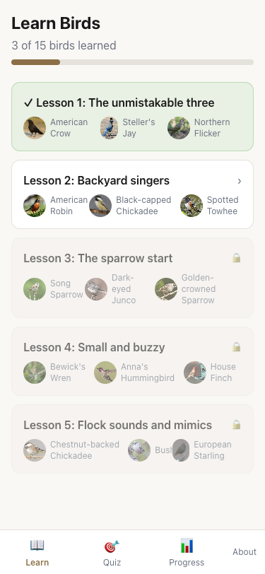
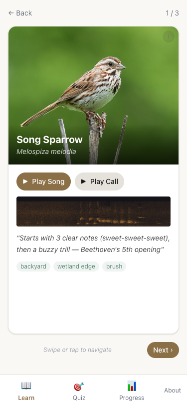
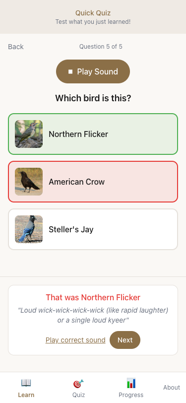

# avilingo-v2

A Duolingo-style web app for learning Seattle-area bird songs and calls. Flash-card style introduction, spaced repetition reviews, and discrimination exercises — all in a mobile-first PWA.

**Live at:** [unformedideas.com/beakspeak](https://unformedideas.com/beakspeak/)

<table>
  <tr>
    <td></td>
    <td></td>
    <td></td>
  </tr>
</table>

## What's been built

**Content pipeline** (`populate_content.py`, `download_media.py`) → **React app** (`beakspeak/`)

### Content (Sprint 0)
- 15 Seattle-area species across 5 lessons, curated by learnability
- Unified candidate pool schema (`audio_clips.candidates`, `schema_version: 2`) with per-clip `candidate_id`, `source_role`, and curator-assigned `selected_role` (`none` / `song` / `call`)
- Mixed candidate ranking (not pre-split song/call buckets): quality grade (A=+50 … E=−30) dominates; metadata bonuses/penalties and optional BirdNET-derived overlap/target signals refine ordering
- Persisted analysis metadata (`analysis`) and persisted trim windows (`segment`) per candidate for reproducible media exports
- Mnemonics, habitat tags, Wikipedia photos, and 5 confuser pairs per species
- `tier1_seattle_birds_populated.json` → `beakspeak/public/content/manifest.json`
- Manual curation via local Audio Admin tool (see below)

### Learn mode (Sprint 1)
- Swipeable bird cards (framer-motion) with edge-to-edge photo, song/call playback, mnemonic
- 5 lessons × 3 birds, each gated on the previous lesson completing
- Intro quiz after each lesson (3-choice, 5 questions) — species only marked "introduced" after quiz
- Forward testing: Lesson 2+ starts with a 2-question warm-up on already-learned birds

### Quiz mode (Sprint 2)
- FSRS-6 spaced repetition with custom auditory-learning parameters (faster initial stability decay)
- Two exercise types: `three_choice` (identify the bird) and `same_different` (same species?)
- 8–10 items per session; exercise type based on rep count (3-choice first, then discrimination)
- Response-time ratings: three_choice fast <2.5s / slow >7s; same_different fast <4s / slow >10s
- Clip rotation: never plays the same clip twice in a row per species
- Confusion event logging for future pair-mastery tracking

### Progress & Credits
- Dashboard: per-species state badges (New / Learning / Review / Relearning), reps, next review date
- Credits page: full attribution for every audio recording and photo, grouped by species

## Running locally

**Prerequisites:** Node.js 18+, the media files already downloaded (see below)

```bash
# 1. Install dependencies
cd beakspeak
npm install

# 2. Start dev server
npm run dev
# → http://localhost:5173
```

The app is a single-page app with no backend — all data is served as static files from `beakspeak/public/content/`.

## Audio Admin

A local-only tool for reviewing the mixed candidate pool, assigning final export roles, and saving non-destructive manual trims for selected clips.

```bash
# Run from repo root (no extra dependencies — Python stdlib only)
python3 admin/server.py
# → http://localhost:8765
```

**What it shows per clip:** spectrogram (pre-rendered), play/pause, quality grade, type (song / call / alarm call / etc.), sex, stage, recording method, location, recordist, score/rank, license, BirdNET/segment evidence, remarks, and a link to the Xeno-canto page. Clips assigned to `song` or `call` also show start/end trim controls, selected-segment preview, save, and reset.

**Species header:** mnemonic and any Wikipedia audio clips for reference.

**Workflow:**
1. Run `uv run python3 populate_content.py` to fetch/rank candidates and persist unified `audio_clips.candidates`
2. Run `uv run python3 download_media.py` to download and normalize candidate media for local preview
3. Open the admin and review mixed ranked candidates; assign each clip to `song`, `call`, or `none`
4. For assigned clips, optionally save manual trim metadata. Trims are saved to `candidate.segment` and do not overwrite local audio.
5. Assignments save immediately to `tier1_seattle_birds_populated.json` via `/api/assign-role`; trims save via `/api/segment`
6. Run `uv run python3 export_app_audio.py --force-audio --export-mode all` (or `--export-mode commercial`) to generate trimmed app audio and regenerate `manifest.json`

## Re-generating media

```bash
# Requires: Python 3.12+, ffmpeg, uv (or pip install requests Pillow)
# Also requires XC_API_KEY env var for populate_content.py
# Optional BirdNET setup for analysis-assisted ranking/segments:
#   BIRDNET_COMMAND or BIRDNET_HOME (falls back to FFmpeg-only when unavailable)

# Full pipeline (re-query Xeno-canto + Wikipedia, re-download everything)
uv run python3 populate_content.py                   # → tier1_seattle_birds_populated.json
uv run python3 download_media.py --export-mode all  # → beakspeak/public/content/ + manifest.json

# Manifest/media rebuild after admin role assignment and optional manual trims
uv run python3 export_app_audio.py --force-audio --export-mode all
uv run python3 export_app_audio.py --force-audio --export-mode commercial
```

Manual trim metadata is non-destructive. The existing source app audio stays at `beakspeak/public/content/audio/{species}/{xc_id}.ogg`; generated trimmed app audio is written to `beakspeak/public/content/audio/{species}/trimmed/{xc_id}.ogg`. If a trimmed output already exists, `export_app_audio.py` warns and skips regeneration unless `--force-audio` is provided. If source app audio is missing, rerun `uv run python3 download_media.py --export-mode all` to restore it before exporting trims.

`export_app_audio.py` does not download original Xeno-canto audio and does not rerun BirdNET analysis. Use `populate_content.py` and `download_media.py` for full source refreshes.

Audio and photos are gitignored; `manifest.json` and `tier1_seattle_birds_populated.json` are checked in.

## Testing

BeakSpeak has four practical validation layers:

- **Type checking** with `tsc`
- **Linting** with `eslint`
- **Unit tests** with `vitest`
- **Mobile end-to-end tests** with Playwright

GitHub Actions runs the same checks in automation, but `test:ci` is mainly a CI mirror and is not the default local workflow.

### Install test tooling

```bash
cd beakspeak
npm install
npx playwright install chromium
```

### Type checking

```bash
cd beakspeak
npm run typecheck
```

### Linting

```bash
cd beakspeak
npm run lint
```

### Unit tests

```bash
cd beakspeak
npm run test:unit
```

`npm run test:unit` is the same Vitest suite as `npx vitest run`.

Current unit coverage includes manifest loading, lesson gating/progression, FSRS scheduling, quiz session building, audio adapter behavior, and component-level interactions.

### Mobile end-to-end test

```bash
cd beakspeak
npm run test:e2e
```

Run this after the flow is implemented and you want browser-level confirmation that the mobile path still works.

The Playwright suite runs at a mobile viewport and currently covers:

- resetting progress to a clean state
- completing Lesson 1
- finishing the intro quiz
- verifying progress persistence
- starting the review flow

Reusable E2E helpers live in `beakspeak/e2e/fixtures.ts` so future browser tests can compose app flows cleanly.

### Manual testing

If you want to sanity-check the app yourself, the usual sequence is:

```bash
cd beakspeak
npm run dev
```

Then verify the main mobile flows in the browser:

- open the Learn tab
- complete Lesson 1
- finish the intro quiz
- check that progress persists after a reload
- open the Progress tab and start a review session

### Full local CI-equivalent run

```bash
cd beakspeak
npm run test:ci
```

This runs:

- `npm run typecheck`
- `npm run lint`
- `npm run test:unit`
- `npm run test:e2e`

Use this only when you explicitly want the full local mirror of CI.

### Continuous integration

GitHub Actions workflow: `.github/workflows/beakspeak-ci.yml`

CI currently performs:

- dependency install
- Playwright Chromium install
- typecheck
- lint
- Vitest
- mobile Playwright E2E
- Playwright report artifact upload when present

## Deploying

The site is deployed to Cloudflare Workers (static assets only, no Worker invocations):

```bash
# Build and assemble the combined site
bash scripts/build-site.sh

# Deploy to Cloudflare
npx --prefix beakspeak wrangler deploy
```

This serves:
- `unformedideas.com/` — landing page
- `unformedideas.com/beakspeak/` — BeakSpeak app

## Project structure

```
beakspeak/
  public/content/
    manifest.json          # Species data with local audio/photo paths
    audio/{species_id}/    # OGG Opus clips (gitignored)
    photos/                # JPEG photos (gitignored)
  src/
    core/                  # Pure TS — no React/DOM deps (portable to iOS later)
      types.ts             # All shared interfaces
      manifest.ts          # Manifest loading + species helpers
      lesson.ts            # Lesson gating, card building, intro quiz generation
      fsrs.ts              # FSRS-6 wrapper with auditory learning params
      quiz.ts              # Quiz session builder, clip/distractor selection
    adapters/
      audio.ts             # WebAudioPlayer — AudioContext, buffer cache, state
      storage.ts           # Dexie (IndexedDB) — progress + confusion log
    store/
      appStore.ts          # Zustand — manifest, progress Map, tab state, actions
    components/
      learn/               # BirdCard, LearnSession, IntroQuiz, LearnTab
      quiz/                # ThreeChoiceQuiz, SameDifferent, QuizSession, QuizTab, QuizResult
      progress/            # Dashboard
      credits/             # CreditsPage
      shared/              # Navigation, AudioButton, AttributionInfo
```

## Key design decisions

- **Self-hosted media** — all audio and photos served from the same origin; no CORS
- **3-choice quizzes** — Rodriguez 2005 meta-analysis: equivalent discrimination to 4-choice, ~5s faster per item
- **8–10 session length** — auditory discrimination is more cognitively taxing per item than visual flashcards
- **No "practice anyway" mode** — early FSRS reviews have near-zero retention benefit; gated by due date
- **Soft lesson gate** — next lesson blocked if any bird is in relearning state (consolidation first)
- **Clip rotation in memory only** — resets on refresh; desirable difficulty without IndexedDB overhead
