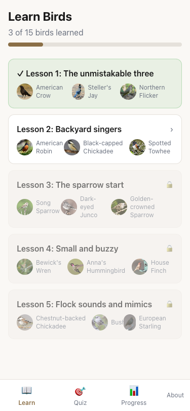
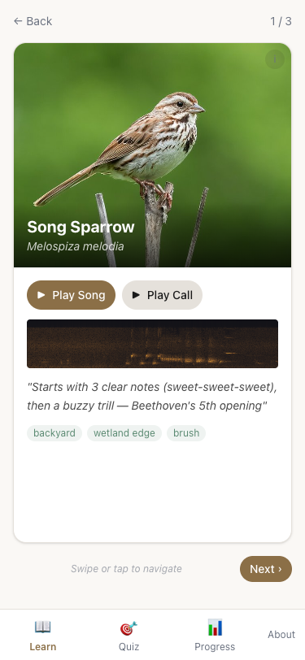
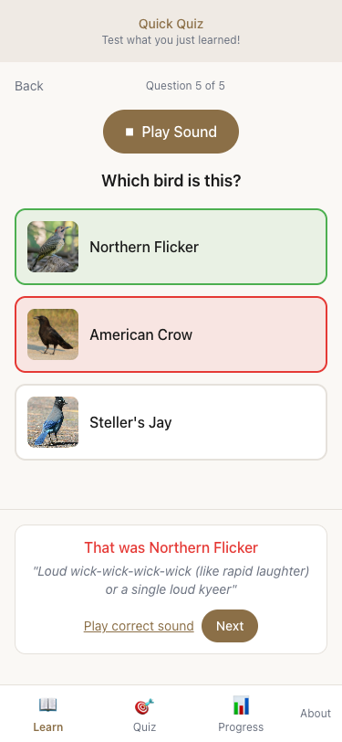

# avilingo-v2

A Duolingo-style web app for learning Seattle-area bird songs and calls. Flash-card style introduction, spaced repetition reviews, and discrimination exercises — all in a mobile-first PWA. Bird recordings are selected explicitly by Xeno-canto ID in a small TOML file, then resolved, trimmed, normalized, and attributed by a reproducible content sync.

**Live at:** [unformedideas.com/beakspeak](https://unformedideas.com/beakspeak/)

<table>
  <tr>
    <td></td>
    <td></td>
    <td></td>
  </tr>
</table>

## What's been built

**Manual audio selections** (`content/audio-selections.toml`) → **content sync** (`manual_audio.py`) → **React app** (`beakspeak/`)

### Content (Sprint 0)
- 15 Seattle-area species across 5 lessons, curated by learnability
- Explicit Xeno-canto recording IDs and app roles, with optional original-source trim intervals
- Automatic ten-second sustained-energy selection when a recording has no manual trim
- Checked-in Xeno-canto metadata and resolved-window lock for reproducible attribution and builds
- Mnemonics, habitat tags, Wikipedia photos, and 5 confuser pairs per species
- `content/manifest-base.json` + manual audio → `beakspeak/public/content/manifest.json`

### Learn mode (Sprint 1)
- Swipeable bird cards (framer-motion) with edge-to-edge photo, song/call playback, mnemonic
- 5 lessons × 3 birds, each gated on the previous lesson completing
- Intro quiz after each lesson (3-choice, 5 questions) — species only marked "introduced" after quiz
- Forward testing: Lesson 2+ starts with a 2-question warm-up on already-learned birds

### Quiz mode (Sprint 2)
- FSRS-6 spaced repetition (default weights, 85% retention target, 180-day interval cap)
- Two exercise types: `three_choice` (identify the bird) and `same_different` (same species?)
- 8–10 items per session; exercise type based on rep count (3-choice first, then discrimination)
- Response-time ratings: three_choice fast <2.5s / slow >7s; same_different fast <4s / slow >10s
- Clip rotation: never plays the same clip twice in a row per species
- Confusion event logging for future pair-mastery tracking

### Progress & Credits
- Dashboard: per-species state badges (New / Learning / Review / Relearning), reps, next review date
- Credits page: full attribution for every audio recording and photo, grouped by species

## Running locally

**Prerequisites:** Node.js 22+, the media files already downloaded (see below)

```bash
# 1. Install dependencies
cd beakspeak
npm install

# 2. Start dev server
npm run dev
# → http://localhost:5173
```

The app is a single-page app with no backend — all data is served as static files from `beakspeak/public/content/`.

## Running on iPhone with Capacitor

The iOS feasibility app packages the same React application as the web build. It targets portrait iPhones on iOS 18.4 or newer; Android is intentionally not configured.

See [`docs/native-ios.md`](docs/native-ios.md) for the complete build, synchronization, Personal Team signing, physical-device launch, and web-regression workflow.

The normal development loop is:

```bash
cd beakspeak
npm install
npm run native:sync
npm run native:open
```

`native:sync` validates the manual-audio lock, builds with relative asset URLs, keeps exactly the production recordings referenced by the manifest, removes legacy/archive media, and synchronizes that output into Xcode. The generated `ios/App/App/public/` directory is ignored; rerun the command after changing web code or content.

## Manual audio selections

`content/audio-selections.toml` is the production source of truth. Each species must have at least one song and one call. The section assigns the app role even when Xeno-canto uses a different type label.

```toml
[[species.stja.songs]]
xc = 603262
start_s = 2.3
end_s = 6.3

[[species.stja.calls]]
xc = "XC109654"
# With no trim, sync chooses the strongest sustained window up to 10 seconds.
```

Trim values are seconds in the untouched Xeno-canto source. Provide both `start_s` and `end_s`, or neither. Manual trims longer than ten seconds are preserved with a warning. The same recording cannot be assigned more than once.

The initial file contains the previous 30 curated choices: one song and one call for all 15 species.

## Synchronizing audio

```bash
# Requires Python 3.12+, uv, ffmpeg, ffprobe, and XC_API_KEY for new metadata.
uv run python3 manual_audio.py

# Deliberately refresh all locked Xeno-canto metadata.
uv run python3 manual_audio.py --refresh-metadata

# Recalculate only automatically chosen windows.
uv run python3 manual_audio.py --refresh-windows

# Offline verification used by the production site build.
uv run python3 manual_audio.py --check
```

Sync fetches metadata for new IDs, caches untouched sources under `.cache/manual-audio/`, and writes generated OGG files under `beakspeak/public/content/audio/manual/`. These media directories are gitignored. Existing outputs and automatic windows are reused until their selection, source URL, algorithm version, or encoder version changes.

`content/audio-metadata.lock.json` and the generated manifest are checked in. The normal site build never contacts Xeno-canto; it fails with sync guidance when selections, metadata, the manifest, or local audio assets are stale or missing.

The previous candidate-ranking, BirdNET, and local Audio Admin workflow remains available as a legacy research tool, but it no longer supplies production audio or the runtime manifest.

## Testing

BeakSpeak has five practical validation layers:

- **Type checking** with `tsc`
- **Linting** with `eslint`
- **Unit tests** with `vitest`
- **Mobile end-to-end tests** with Playwright
- **Installed-app smoke tests** with XCTest on an iOS simulator

GitHub Actions runs all five checks. The `test:ci` command runs the four cross-platform checks and excludes the macOS XCTest smoke.

### Install test tooling

```bash
cd beakspeak
npm install
npx playwright install chromium
```

### Type checking

```bash
cd beakspeak
npm run typecheck
```

### Linting

```bash
cd beakspeak
npm run lint
```

### Unit tests

```bash
cd beakspeak
npm run test:unit
```

`npm run test:unit` is the same Vitest suite as `npx vitest run`.

Current unit coverage includes manifest loading, lesson gating/progression, FSRS scheduling, quiz session building, audio adapter behavior, and component-level interactions.

### Mobile end-to-end test

```bash
cd beakspeak
npm run test:e2e
```

Run this after the flow is implemented and you want browser-level confirmation that the mobile path still works.

The Playwright suite runs at a mobile viewport and currently covers:

- resetting progress to a clean state
- completing Lesson 1
- finishing the intro quiz
- verifying progress persistence
- starting the review flow

Reusable E2E helpers live in `beakspeak/e2e/fixtures.ts` so future browser tests can compose app flows cleanly.

### iOS installed-app smoke test

```bash
cd beakspeak
npm run test:ios
```

Run this after changes to the native build, Capacitor synchronization, Xcode project, app startup, lifecycle or audio integration, storage persistence, or smoke tests. The XCTest suite checks packaged launch and rendering, one accessible navigation step, recovery after backgrounding and foregrounding, and persistence across a force-quit and relaunch. It uses the shortest learner-visible setup needed. Playwright remains responsible for the complete learner journey and shared application behavior.

See [`docs/native-ios.md`](docs/native-ios.md) for prerequisites, simulator selection, artifacts, and physical-device checks. The simulator smoke does not validate audio audibility, silent-switch routing, exact stop-on-background behavior, VoiceOver quality, sustained performance, signing, or physical installation.

### Manual testing

If you want to sanity-check the app yourself, the usual sequence is:

```bash
cd beakspeak
npm run dev
```

Then verify the main mobile flows in the browser:

- open the Learn tab
- complete Lesson 1
- finish the intro quiz
- check that progress persists after a reload
- open the Progress tab and start a review session

### Combined cross-platform test run

```bash
cd beakspeak
npm run test:ci
```

This runs:

- `npm run typecheck`
- `npm run lint`
- `npm run test:unit`
- `npm run test:e2e`

Use this when you want all cross-platform checks in one command. Run `npm run test:ios` separately for the installed-app smoke.

### Continuous integration

GitHub Actions workflow: `.github/workflows/beakspeak-ci.yml`

CI currently performs:

- dependency install
- native build synchronization and an XCTest simulator smoke on macOS
- Playwright Chromium install
- typecheck
- lint
- Vitest
- mobile Playwright E2E
- Playwright report artifact upload when present

## Deploying

BeakSpeak is deployed from this repo to the `/beakspeak/` route on `unformedideas.com`. The root landing page is owned by the `unformedideas` repo, and other projects are deployed from other repos.

```bash
# Build and assemble the BeakSpeak deploy artifact
bash scripts/build-site.sh

# Deploy to Cloudflare
npx --prefix beakspeak wrangler deploy
```

This serves only:

- `unformedideas.com/beakspeak`
- `unformedideas.com/beakspeak/`
- `www.unformedideas.com/beakspeak`
- `www.unformedideas.com/beakspeak/`

Do not add the root `unformedideas.com/` landing page or other project assets to this repo. Root content belongs in `unformedideas`; other projects are deployed from other repos.

## Project structure

```
beakspeak/
  public/content/
    manifest.json          # Species data with local audio/photo paths
    audio/manual/          # Generated manual-selection OGG clips (gitignored)
    photos/                # JPEG photos (gitignored)
  src/
    core/                  # Pure TS — no React/DOM deps (portable to iOS later)
      types.ts             # All shared interfaces
      manifest.ts          # Manifest loading + species helpers
      lesson.ts            # Lesson gating, card building, intro quiz generation
      fsrs.ts              # FSRS-6 wrapper with auditory learning params
      quiz.ts              # Quiz session builder, clip/distractor selection
    adapters/
      audio.ts             # WebAudioPlayer — AudioContext, buffer cache, state
      storage.ts           # Dexie (IndexedDB) — progress + confusion log
    store/
      appStore.ts          # Zustand — manifest, progress Map, tab state, actions
    components/
      learn/               # BirdCard, LearnSession, IntroQuiz, LearnTab
      quiz/                # ThreeChoiceQuiz, SameDifferent, QuizSession, QuizTab, QuizResult
      progress/            # Dashboard
      credits/             # CreditsPage
      shared/              # Navigation, AudioButton, AttributionInfo
```

At the repository root, `content/manifest-base.json` owns non-audio app content, `content/audio-selections.toml` owns human recording choices, and `content/audio-metadata.lock.json` records fetched metadata and generated-output state.

## Key design decisions

- **Self-hosted media** — all audio and photos served from the same origin; no CORS
- **3-choice quizzes** — Rodriguez 2005 meta-analysis: equivalent discrimination to 4-choice, ~5s faster per item
- **8–10 session length** — auditory discrimination is more cognitively taxing per item than visual flashcards
- **No "practice anyway" mode** — early FSRS reviews have near-zero retention benefit; gated by due date
- **Soft lesson gate** — next lesson blocked if any bird is in relearning state (consolidation first)
- **Clip rotation in memory only** — resets on refresh; desirable difficulty without IndexedDB overhead
